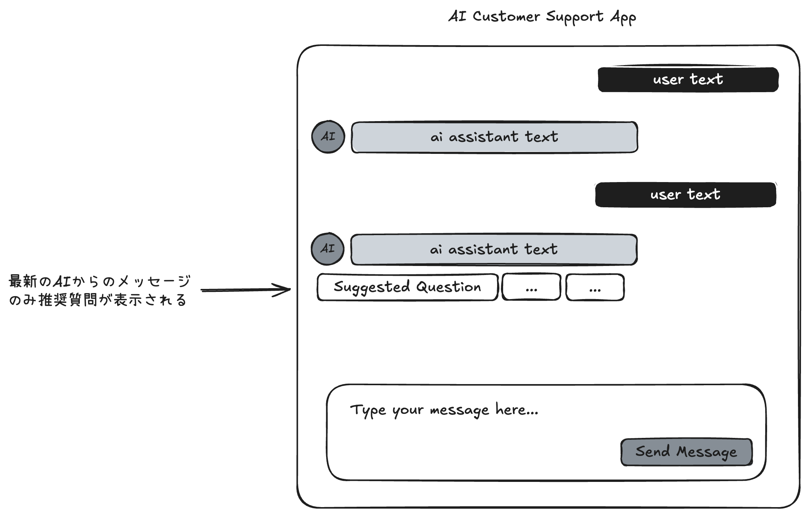

# AIカスタマーサポートチャットアプリ技術課題

## ワイヤーフレーム



## 課題の背景と目的

この技術課題では、ワイヤーフレームを参考に、カスタマーサポート用のAIチャットインターフェースを実装していただきます。本課題は、フロントエンド開発のスキル、特にReactとTypeScriptの理解度、およびユーザー体験を考慮したUI設計能力を評価することを目的としています。

## 課題概要

顧客がAIカスタマーサポートとチャットできるWEBアプリケーションを開発してください。AIからのレスポンスはローカルで実装し、実際のAPIを呼び出す必要はありません (サンプルとしてMSWのモックを用意しています)。

**想定所要時間**: 8〜10時間

## 技術要件

- **必須技術**:

  - React
  - TypeScript

- **使用禁止技術**:

  - フルスタックなチャットUIライブラリ (e.g. [lobe-chat](https://github.com/lobehub/lobe-chat))

## 機能要件

**チャットインターフェース**

- ユーザーとAIカスタマーサポート間のメッセージ表示
  - ユーザーとAIのメッセージを視覚的に区別
- メッセージ入力フォームと送信機能
- 送信中/処理中の状態表示

## オプション機能 (加点対象)

- ダーク/ライトモード切替
- レスポンシブ対応 (Desktop / Mobile)
- メッセージのマークダウン形式サポート
- 「AIが入力中...」などのタイピングインジケーター
- ユーザーへの提案質問表示

## 制約条件

- 外部APIは使用せず、完全にローカルで動作すること

## 提出方法

### 【手順1：新しいプライベートリポジトリの作成】

1. GitHubの「New Repository」ページから、新規リポジトリを作成します。  
   - **リポジトリ名**は任意（元のリポジトリと同じ名前にする必要はありません）。  
   - 「Private」を選択してください。

### 【手順2：公開リポジトリのbare cloneを作成】

2. ターミナルで、以下のコマンドを実行して、元の公開リポジトリの**bare clone**を作成します。

```bash
git clone --bare https://github.com/awarefy/coding-assignment.git
```

※ `--bare` オプションを使うことで、作業用のワーキングツリーがない完全なリポジトリコピーが得られます。

### 【手順3：プライベートリポジトリへのmirror push】

3. bare cloneしたディレクトリに移動し、mirror pushを行います。

```bash
cd coding-assignment.git
git push --mirror https://github.com/自分のユーザー名/新規プライベートリポジトリ.git
```

これで、元の公開リポジトリの全てのブランチ、タグ、履歴がプライベートリポジトリに複製されます。

### 【手順4：一時ディレクトリの削除とローカルクローンの作成】

4. 一時的に作成したbare cloneを削除し、自分の作業用にプライベートリポジトリをクローンします。

```bash
cd ..
rm -rf coding-assignment.git

git clone https://github.com/自分のユーザー名/新規プライベートリポジトリ.git
```

### 【提出時の注意事項】

1. 実装が完了したら、成果物をプライベートリポジトリにpushしてください
2. プライベートリポジトリのURLを提出し、アクセス権限を共有してください
3. `ai-customer-support-app/README.md` を更新し、以下を記載してください:
   - セットアップ手順と実行方法
   - 実装の概要と使用した技術の説明
   - 設計上の決定事項や工夫した点
   - 改善点や追加したい機能（時間があればどう拡張するか）

## ヒント

- ワイヤーフレームを参考にしつつも、自分なりの解釈や改善を加えても構いません
- 時間配分に注意し、基本機能を優先的に実装してください

この課題を通して、実用的なWEBアプリケーションを設計・実装する能力を示していただければ幸いです。ご質問がありましたら、お気軽にお問い合わせください。
